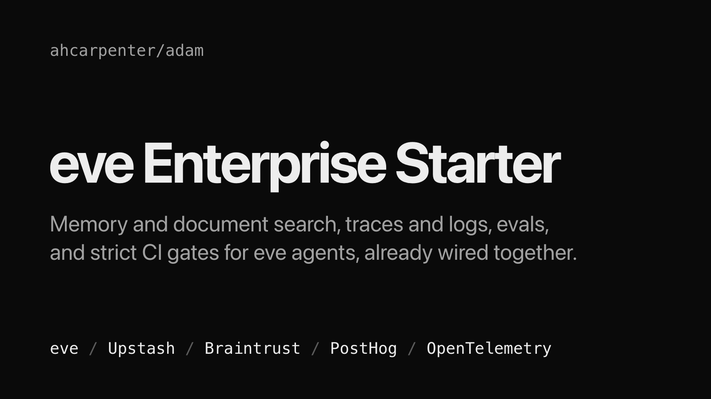

# adam: Enterprise starter for eve agents

<p align="center">
  <a href="https://github.com/ahcarpenter/adam/actions/workflows/ci.yml"></a>
  <a href="https://github.com/ahcarpenter/adam/blob/main/LICENSE"></a>
  <a href="https://nodejs.org"></a>
  <a href="https://eve.dev"></a>
</p>

<p align="center">
  
</p>

<p align="center">
  <code>adam</code> is a production-shaped starting point for <a href="https://eve.dev">eve</a> agents — observability, evals, dependency automation, and a 95% coverage gate already wired together. Fork it and delete what you do not need, instead of assembling it a second time.
</p>

<p align="center">
  <a href="#deploy-to-vercel">Deploy</a> ·
  <a href="#quick-start">Quick Start</a> ·
  <a href="docs/configuration.md">Configuration</a> ·
  <a href="docs/observability.md">Observability</a> ·
  <a href="docs/capabilities.md">Capabilities</a> ·
  <a href="CONTRIBUTING.md">Contributing</a> ·
  <a href="https://eve.dev/docs">eve docs</a>
</p>

## Deploy to Vercel

[](https://vercel.com/new/clone?repository-url=https%3A%2F%2Fgithub.com%2Fahcarpenter%2Fadam&project-name=adam&repository-name=adam&env=BRAINTRUST_API_KEY%2CPOSTHOG_PROJECT_TOKEN&envDescription=Braintrust%20API%20key%20and%20PostHog%20project%20token.%20The%20build%20fails%20until%20both%20are%20set.%20Upstash%20Redis%20is%20provisioned%20for%20you%2C%20and%20the%20model%20runs%20through%20Vercel%20AI%20Gateway%20and%20needs%20no%20key.&envLink=https%3A%2F%2Fgithub.com%2Fahcarpenter%2Fadam%2Fblob%2Fmain%2Fdocs%2Fconfiguration.md&stores=%5B%7B%22type%22%3A%22integration%22%2C%22integrationSlug%22%3A%22upstash%22%2C%22productSlug%22%3A%22upstash-kv%22%2C%22protocol%22%3A%22storage%22%7D%5D&demo-title=adam%20live%20demo&demo-description=A%20public%20deployment%20of%20this%20starter.%20No%20chat%20page%20in%20the%20browser%3A%20chat%20from%20eve%27s%20terminal%20client.%20Conversations%20are%20recorded.&demo-url=https%3A%2F%2Fadam-umber.vercel.app&demo-image=https%3A%2F%2Fraw.githubusercontent.com%2Fahcarpenter%2Fadam%2Fmain%2Fdocs%2Fassets%2Fthumbnail.png)

The button clones the repository and asks for two values: `BRAINTRUST_API_KEY` and
`POSTHOG_PROJECT_TOKEN`. The build fails until both are set. Redis asks for nothing: the
button creates an Upstash Redis store from the Vercel Marketplace, which sets
`KV_REST_API_URL` and `KV_REST_API_TOKEN` on the project. The model asks for nothing
either: it runs through the [Vercel AI Gateway](https://vercel.com/docs/ai-gateway),
which a Vercel deployment reaches with its own project credentials and bills to the
team's AI Gateway credits. See [Configuration](docs/configuration.md) for what each
value is.

The button also shows a demo card for a live deployment of this repository at
<https://adam-umber.vercel.app>. It has no chat page in the browser: the page at that
address shows eve's status and the terminal connect command. Chat with it from eve's
terminal client, with nothing to sign in to:

```sh
npx eve remote connect --url https://adam-umber.vercel.app
```

- **Conversations are recorded.** Your messages and the model's replies are sent in
  full to Braintrust and PostHog, so do not type anything private.
- **You can chat, and nothing else.** The agent remembers what you tell it within a
  session and can search the deployment's shared document index. It has no shell, file
  or web tools, and it takes 20 messages a minute from one address.
- **It runs under a spend limit.** When the limit is used up, the demo can be
  unavailable.

[Anonymous access](docs/configuration.md#anonymous-access) describes how the demo is
set up.

## Quick Start

Requires [Node.js](https://nodejs.org) `24.x` and pnpm `12.x`.

Click **Use this template** above, or clone it:

```sh
git clone https://github.com/ahcarpenter/adam.git
cd adam
pnpm install
```

Fill in the environment — startup validates every variable, in every mode:

```sh
cp env.example .env.local
```

Every variable without a default must be filled: the Upstash Redis URL and token (under
the `UPSTASH_REDIS_REST_` names or the Vercel Marketplace's `KV_REST_API_` names),
`BRAINTRUST_API_KEY`, and `POSTHOG_PROJECT_TOKEN` (or the Vercel Marketplace's
`NEXT_PUBLIC_POSTHOG_PROJECT_TOKEN` and `NEXT_PUBLIC_POSTHOG_HOST`). See
[Configuration](docs/configuration.md) for the full table.

The model runs through the Vercel AI Gateway, so a local run also needs a gateway
credential, which startup does not check. The simplest is an AI Gateway API key: set
`AI_GATEWAY_API_KEY` in `.env.local`. A linked Vercel project works too.
[Model access](docs/configuration.md#model-access) covers both paths, and what a Vercel
team needs before the first call.

Then start the agent:

```sh
pnpm dev            # TUI at http://127.0.0.1:2000
```

## What's included

- **Agent runtime** — [eve](https://eve.dev) with the AI SDK, the model routed through
  the Vercel AI Gateway: no provider key, and one optional, validated variable to
  change the model.
- **Memory, RAG, and chat history** — Upstash Redis via AgentKit, plus per-caller rate
  limiting and a tool cache. See [capabilities](docs/capabilities.md).
- **Observability** — structured winston logs to PostHog, AI traces to Braintrust and
  PostHog LLM analytics, OTel metrics to any OTLP collector. The design, the three
  alerts worth paging on, and how to verify the pipeline are in
  [docs/observability.md](docs/observability.md).
- **Quality gates in CI** — Biome, Prettier, `tsc`, a real `eve build`, Knip, and Vitest
  at 95% project and patch coverage through Codecov.
- **Dependency automation** — Renovate, with the eve/AgentKit contract pairing already
  encoded so a bump cannot silently break `eve build`.
- **Evals** — deterministic eval suites under `evals/`, reporting to their own
  Braintrust project.

## Why this starter

- **Fails fast, everywhere.** An incomplete environment stops the process at module
  load — in local dev too, not only in production.
- **Instrumentation cannot take down the agent.** Every hook runs inside `neverThrow`,
  because eve escalates a thrown hook to a failed turn.
- **Signals earn their place.** Each metric and log line maps to a question on-call
  actually has to answer; cardinality stays in logs and traces, not in metric labels.
- **CI builds, not just typechecks.** `tsc` does not run eve's compiler, so CI runs
  `eve build` — otherwise extension contract breaks are invisible until deploy.
- **The reasoning is written down.** Comments and docs say why a decision was made, not
  what the line does.

## Commands

```sh
pnpm dev            # eve dev (TUI at http://127.0.0.1:2000)
pnpm build          # eve build
pnpm typecheck      # tsc
pnpm lint           # biome lint --write . (auto-fix)
pnpm lint:check     # biome lint . (no writes)
pnpm lint:ci        # biome ci . (lint + format, CI mode)
pnpm format         # biome check --write + prettier --write (md/yml/css)
pnpm format:check   # biome check + prettier --check
pnpm test           # vitest run
pnpm test:coverage  # vitest run --coverage (95% thresholds)
pnpm eval           # eve eval
pnpm knip           # dead code / unused dependency scan
```

`pnpm build` also prepares the agent's sandbox, as eve 0.68 does on every build. Off
Vercel, eve picks Docker when the Docker daemon answers within about 5 seconds, and
otherwise falls back to microsandbox (Apple Silicon macOS, or Linux with KVM) or else
just-bash, neither of which adam installs, so the build fails.
Either have Docker running, or run `pnpm build --skip-sandbox-prewarm` for a
compile-only check, which is what CI runs. Do not deploy output built that way: it may
not be able to start its sandbox.

## Learn More

- [Configuration](docs/configuration.md) — environment variables and one-time setup
- [Observability design](docs/observability.md) — signals, alerts, verification
- [Upstash capabilities](docs/capabilities.md) — memory, RAG, rate limiting, tool cache
- [Spec, plan, and task history](specs/enterprise-boilerplate.md)
- [eve documentation](https://eve.dev/docs)

## Contributing

Contributions are welcome — see [CONTRIBUTING.md](CONTRIBUTING.md) to get started, and
[SUPPORT.md](SUPPORT.md) for where to ask questions.

This project follows the [Contributor Covenant](CODE_OF_CONDUCT.md). Security
vulnerabilities go through [SECURITY.md](SECURITY.md), never the issue tracker.

## License

MIT — see [LICENSE](LICENSE).
